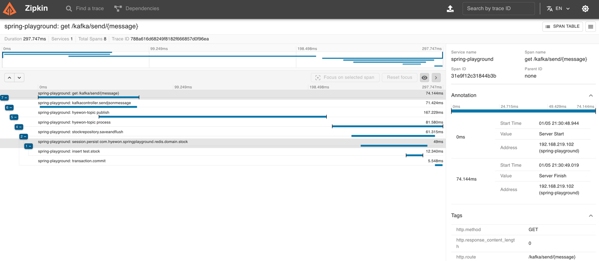
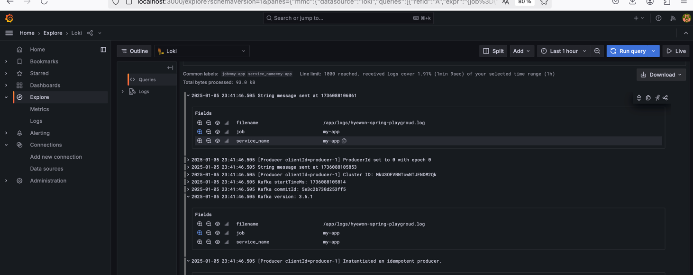
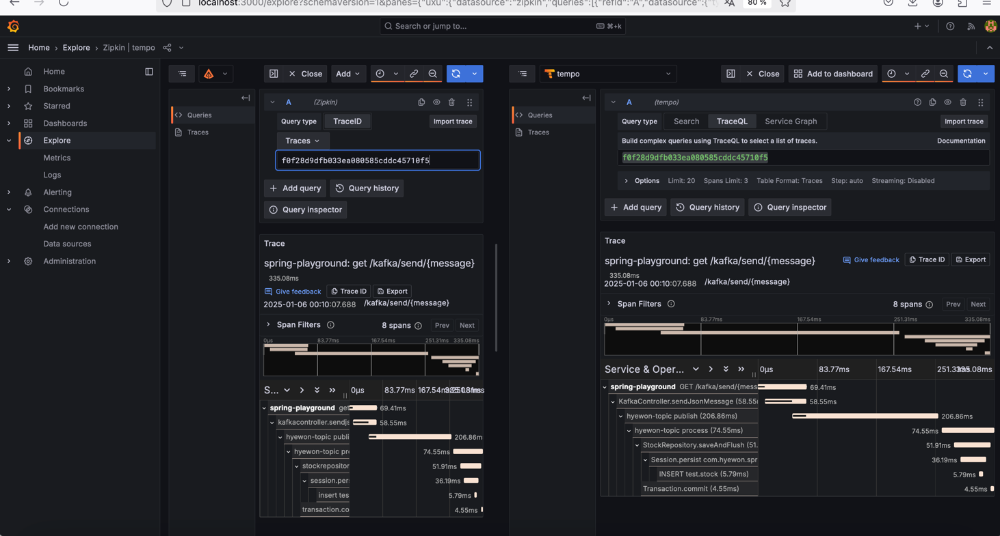
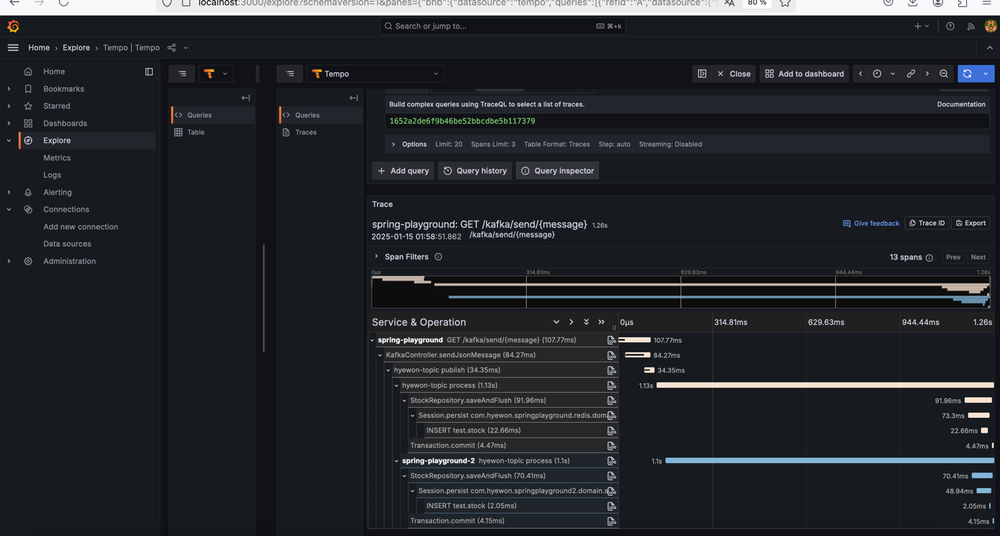
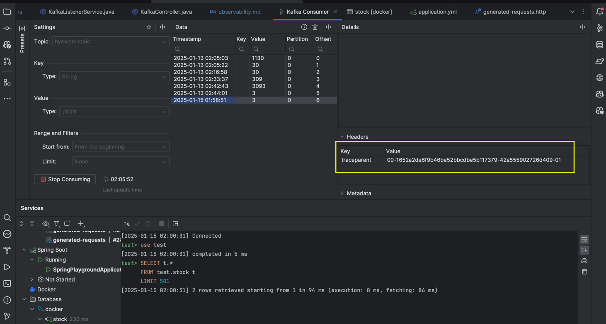
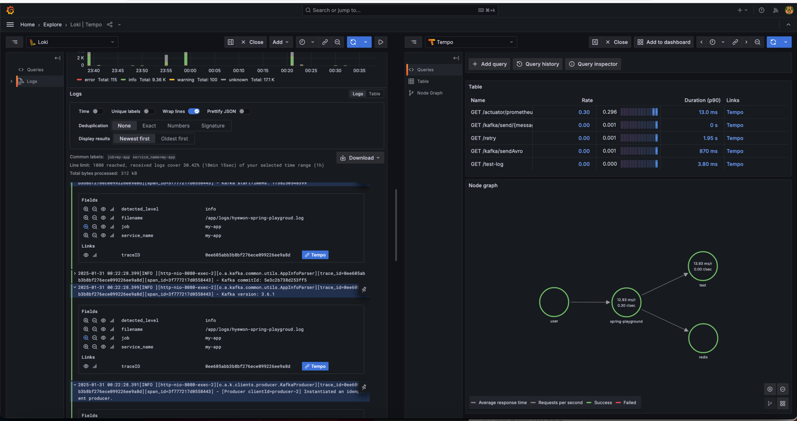

# Observability

## OpenTelemetry Instrumentation with Java Agent

### 1. Opentelemetry Java Agent 다운받아서 실행하기
- 오픈텔레메트리 자바 에이전트 다운로드
    ```bash
    curl -L -O https://github.com/open-telemetry/opentelemetry-java-instrumentation/releases/latest/download/opentelemetry-javaagent.jar
    ```
  
- 오픈텔레메트리 자바 에이전트와 함께 애플리케이션 실행
    ```bash
    ./gradlew build 
  
    java -javaagent:opentelemetry-javaagent.jar \
         -jar build/libs/spring-playground-0.0.1-SNAPSHOT.jar
    ```
  ```bash
    hazel@janghyewon-ui-MacBookAir spring-playground % java -javaagent:opentelemetry-javaagent.jar -jar build/libs/spring-playground-0.0.1-SNAPSHOT.jar
    OpenJDK 64-Bit Server VM warning: Sharing is only supported for boot loader classes because bootstrap classpath has been appended
    [otel.javaagent 2025-01-05 18:42:23:360 +0900] [main] INFO io.opentelemetry.javaagent.tooling.VersionLogger - opentelemetry-javaagent - version: 2.11.0
    18:42:25,168 |-INFO in ch.qos.logback.core.joran.spi.ConfigurationWatchList@6a0c7af6 - URL [jar:nested:/Users/hazel/Documents/workspace/spring-playground/build/libs/spring-playground-0.0.1-SNAPSHOT.jar/!BOOT-INF/classes/!/logback-spring.xml] is not of type file
    18:42:25,169 |-INFO in ch.qos.logback.core.joran.spi.ConfigurationWatchList@6a0c7af6 - URL [jar:nested:/Users/hazel/Documents/workspace/spring-playground/build/libs/spring-playground-0.0.1-SNAPSHOT.jar/!BOOT-INF/classes/!/logback-spring.xml] is not of type file
  ```
  - 혹은 아래처럼 인텔리제이에서 VM options & Program arguments 설정
    - Add VM options: `-javaagent:opentelemetry-javaagent.jar`
    - Add Program arguments: `-jar build/libs/spring-playground-0.0.1-SNAPSHOT.jar`
    

- 오픈텔레메트리 콘솔 옵션 설정해서 실행 (아직은 collector 없으므로, 콘솔에서 로깅)
    ```bash
    java -javaagent:opentelemetry-javaagent.jar \
         -Dotel.traces.exporter=logging \
         -Dotel.metrics.exporter=logging \
         -Dotel.logs.exporter=logging \
          -jar build/libs/spring-playground-0.0.1-SNAPSHOT.jar
    ```
  
- 로그 확인
  ```
  [otel.javaagent 2025-01-05 19:07:28:440 +0900] [http-nio-8080-exec-3] INFO io.opentelemetry.exporter.logging.LoggingSpanExporter - 'POST' : 0b8668f4896a5aafccf3ce1cf860f223 f718bd702d18f121 CLIENT [tracer: io.opentelemetry.http-url-connection:2.11.0-alpha] AttributesMap{data={server.port=8081, http.response.status_code=200, url.full=http://127.0.0.1:8081/subjects/test-avro-topic-value/versions, thread.id=215, thread.name=http-nio-8080-exec-3, server.address=127.0.0.1, network.protocol.version=1.1, http.request.method=POST}, capacity=128, totalAddedValues=9}
  ```
  - `otel.javaagent`: 로그가 OpenTelemetry Java Agent에서 생성되었음을 나타냄.
  - `http-nio-8080-exec-3`: 로그를 생성한 스레드 이름 (HTTP 요청을 처리하는 스레드).
  - `io.opentelemetry.exporter.logging.LoggingSpanExporter`: 로그를 출력한 OpenTelemetry의 Span Exporter.
  - `POST`: HTTP 요청 메서드.
  - `0b8668f4896a5aafccf3ce1cf860f223`: 현재 Span의 ID.
    - `f718bd702d18f121`: Parent Span의 ID (상위 Span ID).
    - `CLIENT`: Span의 유형 (CLIENT는 클라이언트 요청에서 생성된 Span).
  - `[tracer: io.opentelemetry.http-url-connection:2.11.0-alpha]`: 트레이서를 생성한 OpenTelemetry 구성 요소와 버전.
  - `AttributesMap{data={...}}`: Span에 연결된 속성 정보.
    - `server.port=8081` : 요청이 전송된 서버의 포트 번호.
    - `http.response.status_code=200` : 서버로부터 반환된 HTTP 상태 코드 
    - `url.full=http://127.0.0.1:8081/subjects/test-avro-topic-value/versions` : 요청이 전송된 전체 URL. 
    - `thread.id=215` : 요청을 처리한 스레드의 ID. 
    - `thread.name=http-nio-8080-exec-3` : 요청을 처리한 스레드의 이름. 
    - `server.address=127.0.0.1` : 요청이 전송된 서버의 주소. 
    - `network.protocol.version=1.1` : 사용된 네트워크 프로토콜의 버전 (HTTP/1.1).


- (어플리케이션 도커 이미지로 실행하는 경우)
  ```dockerfile
  FROM ubuntu:20.04
  LABEL authors="hazel"
  
  ADD build/libs/playground.jar /playground.jar
  ADD https://github.com/open-telemetry/opentelemetry-java-instrumentation/releases/latest/download/opentelemetry-javaagent.jar /opentelemetry-javaagent.jar
  
  ENTRYPOINT java -javaagent:/opentelemetry-javaagent.jar \
                  -Dotel.traces.exporter=logging \
                  -Dotel.metrics.exporter=logging \
                  -Dotel.logs.exporter=logging \
                  -jar /playground.jar
  
  ```
  ```dockerfile
  version: '3'
  services:
    my-app:
    build: ./ # Dockerfile 위치
    ports:
    - "8080:8080"
  ```

### 2. OpenTelemetry Java Agent 설정하기
#### 2.1. 어플리케이션 fatJar 이름 설정
```gradle
bootJar {
    archiveFileName = 'playground.jar'
}
```
#### 2.2. OpenTelemetry Java Agent build.gradle에 추가하기
manual하게 파일을 다운받는 것이 아닌, build.gradle에 의존성을 추가하여 자동으로 다운로드하도록 설정할 수 있음.
- custom configuration 추가
```gradle
configurations {
    compileOnly {
        extendsFrom annotationProcessor
    }
    agent
}
```

- agent 의존성 추가, agent 파일을 복사하는 task 추가, bootJar task에 dependsOn 추가
```gradle
dependencies {
    agent "io.opentelemetry.javaagent:opentelemetry-javaagent:1.32.0"
...}


// opentelemetry-javaagent-1.32.0-all.jar -> opentelemetry-javaagent.jar
task copyAgent(type: Copy) {
    from configurations.agent {
        rename "opentelemetry-javaagent-.*\\.jar", "opentelemetry-javaagent.jar"
    }
    into layout.buildDirectory.dir("agent")
}

bootJar {
    dependsOn(copyAgent)
    archiveFileName = 'playground.jar'
}
```

어플리케이션 실행시 vm옵션 수정
```bash
java -javaagent:build/agent/opentelemetry-javaagent.jar \
      -Dotel.traces.exporter=logging \
      -Dotel.metrics.exporter=logging \
      -Dotel.logs.exporter=logging \
      -jar build/libs/playground.jar
```

(dockerfile로 어플리케이션 실행시)
```dockerfile
ADD build/libs/playground.jar /playground.jar
ADD build/agent/opentelemetry-javaagent.jar /opentelemetry-javaagent.jar

ENTRYPOINT java -javaagent:/opentelemetry-javaagent.jar \
                -Dotel.traces.exporter=logging \
                -Dotel.metrics.exporter=logging \
                -Dotel.logs.exporter=logging \
                -jar /playground.jar
```

### 3. OpenTelemetry Agent로 수집한 데이터 Jaeger, Zipkin으로 전송하기
#### 3.1 Jaeger 설치
```dockerfile
  jaeger:
    image: jaegertracing/all-in-one:latest
    environment:
      - COLLECTOR_OTLP_ENABLED=true
      - COLLECTOR_GRPC_ENABLED=true # gRPC 포트 활성화
    restart: always
    ports:
      - "16686:16686" # for the Web UI
      - "4317:4317" # for gRPC protocol to send spans
```

- vm 옵션 수정
```bash
-javaagent:build/agent/opentelemetry-javaagent.jar
-Dotel.traces.exporter=otlp
-Dotel.exporter.otlp.endpoint=http://localhost:4317
-Dotel.metrics.exporter=logging
-Dotel.logs.exporter=none
```
(또는 dockerfile로 어플리케이션 실행시)
```dockerfile
ENTRYPOINT java -javaagent:/opentelemetry-javaagent.jar \
                -Dotel.traces.exporter=otlp \
                -Dotel.exporter.otlp.endpoint=http://localhost:4317 \
                -Dotel.metrics.exporter=logging \
                -Dotel.logs.exporter=logging \
                -jar /playground.jar
```


#### 3.2 jaeger UI 확인
- http://localhost:16686
- Trace 흐름
  1. Rest Controller에서 HTTP 요청을 받음 
  2. Kafka Producer로 메시지 전송
  3. Kafka Consumer로 메시지 수신
  4. Kafka Consumer에서 Stock 저장


#### 4.1 Zipkin 설치
```dockerfile
  zipkin:
    image: openzipkin/zipkin:latest
    restart: always
    ports:
      - "9411:9411"
```

- vm 옵션 수정
```bash
-javaagent:build/agent/opentelemetry-javaagent.jar
-Dotel.traces.exporter=otlp,zipkin
-Dotel.exporter.otlp.endpoint=http://localhost:4317
-Dotel.exporter.zipkin.endpoint=http://localhost:9411/api/v2/spans
-Dotel.metrics.exporter=logging
-Dotel.logs.exporter=none
```

#### 4.2 zipkin UI 확인
- http://localhost:9411/zipkin



### 5. Prometheus, Grafana로 메트릭 모니터링하기
#### 5.1 Prometheus 설치
- docker compose 파일에 prometheus 추가
```dockerfile
  prometheus:
    image: prom/prometheus:latest
    volumes:
      - ./docker/prometheus.yml:/etc/prometheus/prometheus.yml
    command:
      - '--config.file=/etc/prometheus/prometheus.yml'
    ports:
      - "9090:9090"
    networks:
      - my_network
```
- prometheus.yml 설정
```yaml
  - job_name: "otel_collector"
    honor_timestamps: true
    scrape_interval: 15s
    scrape_timeout: 10s
    metrics_path: /metrics
    scheme: http
    static_configs:
      - targets: ['host.docker.internal:9464']
```
- vm 옵션 수정
```bash
-javaagent:build/agent/opentelemetry-javaagent.jar
-Dotel.traces.exporter=otlp,zipkin
-Dotel.exporter.otlp.endpoint=http://localhost:4317
-Dotel.exporter.zipkin.endpoint=http://localhost:9411/api/v2/spans
-Dotel.metrics.exporter=prometheus
-Dotel.exporter.prometheus.port=9464
-Dotel.exporter.prometheus.host=0.0.0.0
-Dotel.logs.exporter=none
```

- prometheus UI 확인
  - http://localhost:9090
  - `otel_collector` job 추가 확인


#### 5.2 Grafana 설치
- docker compose 파일에 grafana 추가
```dockerfile
  grafana:
    image: grafana/grafana:latest
    ports:
      - "3000:3000"
    networks:
      - my_network
```

- Grafana UI 확인
  - http://localhost:3000

### 6. 로그 수집하기 with Promtail, Loki
#### 6.1 Promtail 설치
- docker compose 파일에 promtail 추가
```dockerfile
  promtail:
    image: grafana/promtail:latest
    ports:
      - "9080:9080"
    volumes:
      - ./logs:/app/logs  # 로그 디렉토리 마운트
      - ./docker/promtail-config.yml:/etc/promtail/promtail-config.yml
    command: -config.file=/etc/promtail/promtail-config.yml
    restart: always
    networks:
      - my_network
```

- promtail-config.yml 설정
```yaml
server:
  http_listen_address: 0.0.0.0
  http_listen_port: 9080
  enable_runtime_reload: true # HTTP 요청으로 리로드 활성화

positions:
  filename: /tmp/positions.yaml

clients:
  - url: http://loki:3100/loki/api/v1/push # push할 Loki의 주소

scrape_configs:
  - job_name: my-app
    static_configs:
      - targets:
          - localhost
        labels:
          job: my-app
          __path__: /app/logs/*.log
```

#### 6.2 Loki 설치
- docker compose 파일에 loki 추가
```dockerfile
  loki:
    image: grafana/loki:latest
    ports:
      - "3100:3100"
    volumes:
      - ./loki-data:/loki
    command: -config.file=/etc/loki/local-config.yaml
    restart: always
    networks:
      - my_network
```

- Grafana UI 확인
  - http://localhost:3000
  - `Explore`에서 Loki datasource 추가
  - `Log`에서 로그 확인



### 7. Tempo로 분산 추적하기
#### 7.1 Tempo 설치
- docker compose 파일에 tempo 추가
```dockerfile
  tempo:
    image: grafana/tempo:latest
    ports:
      - "16686:16686"
    networks:
      - my_network
```

- vm 옵션 수정
```bash
-javaagent:build/agent/opentelemetry-javaagent.jar
-Dotel.traces.exporter=otlp,zipkin
-Dotel.exporter.otlp.endpoint=http://localhost:4317
-Dotel.exporter.zipkin.endpoint=http://localhost:9411/api/v2/spans
-Dotel.metrics.exporter=prometheus
-Dotel.exporter.prometheus.port=9464
-Dotel.exporter.prometheus.host=0.0.0.0
-Dotel.logs.exporter=none
```


### 8. 분산 시스템에서 추적 확인
- spring-playground 어플리케이션 실행
- spring-playground2 어플리케이션 실행

1. spring-playground 에서 Kafka Producer로 메시지 전송
2. spring-playground, spring-playground2에서 각각 Kafka Consumer로 메시지 수신
3. 각 컨슈머에서 Stock 저장 (MySQL)



- Kafka 토픽의 Header에서 Trace Parent ID 확인



### 9. Otel Collector로 메트릭, 트레이스 수집하기
#### 9.1 Otel Collector 설치
- docker compose 파일에 otel-collector 추가
```dockerfile
  otel-collector:
    image: otel/opentelemetry-collector:latest
    volumes:
      - ./docker/otel-collector-config.yml:/etc/otel-collector-config.yml
    command: --config=/etc/otel-collector-config.yml
    ports:
      - 4318:4317  # OTLP gRPC receiver (Application -> Collector (Push))
      - 9464:9464  # 🚀 Prometheus Exporter 포트 추가 (Prometheus -> Collector (Pull))
      - 13133:13133 # health_check extension
    networks:
      - my_network
```

#### 9.2 메트릭 수집하기
- ASIS : (Java Agent) --> Prometheus
- TOBE : (Java Agent) --OTLP--> (OTel Collector) --Prometheus Exporter--> (Prometheus)

- otel-collector-config.yml 설정
```yaml
exporters:
  prometheus:
    endpoint: "0.0.0.0:9464"  # 🚀 Prometheus가 OTel Collector에서 가져갈 엔드포인트

service:
  pipelines:
    metrics:
      receivers: [otlp]
      processors: [batch]
      exporters: [prometheus]
```

- vm 옵션 수정
- ASIS VM 옵션
  ```bash
  -javaagent:opentelemetry-javaagent.jar
  -Dotel.traces.exporter=otlp,jaeger
  -Dotel.exporter.otlp.endpoint=http://localhost:4318
  -Dotel.exporter.otlp.protocol=grpc
  -Dotel.exporter.jeager.endpoint=http://localhost:14250
  -Dotel.metrics.exporter=prometheus
  -Dotel.exporter.prometheus.port=9464
  -Dotel.exporter.prometheus.host=0.0.0.0
  -Dotel.logs.exporter=logging
  ```
- TOBE VM 옵션
  ```bash
  -javaagent:opentelemetry-javaagent.jar
  -Dotel.traces.exporter=otlp,jaeger
  -Dotel.exporter.otlp.endpoint=http://localhost:4318
  -Dotel.exporter.otlp.protocol=grpc
  -Dotel.exporter.jeager.endpoint=http://localhost:14250
  -Dotel.metrics.exporter=otlp
  -Dotel.logs.exporter=logging
  ```

- prometheus config 수정
```yaml
- job_name: "otel_collector"
  honor_timestamps: true
  scrape_interval: 15s
  scrape_timeout: 10s
  metrics_path: /metrics
  scheme: http
  static_configs:
    - targets: ['collector:9464']  # 🚀 Collector에서 메트릭을 가져오도록 수정
```

#### 9.3 트레이스 수집하기
- ASIS : (Java Agent) --> tempo
- TOBE : (Java Agent) --OTLP--> (OTel Collector) --> tempo

- otel-collector-config.yml 설정
```yaml
exporters:
  otlp/tempo:
    endpoint: "http://tempo:4317"
    tls:
      insecure: true

  service:
    pipelines:
      traces:
        receivers: [otlp]
        processors: [filter/spans,batch]
        exporters: [otlp/tempo]
```
